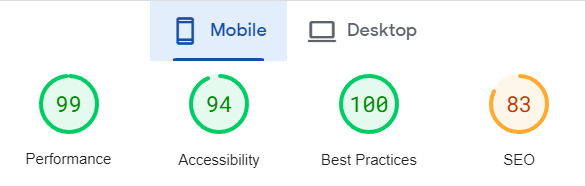
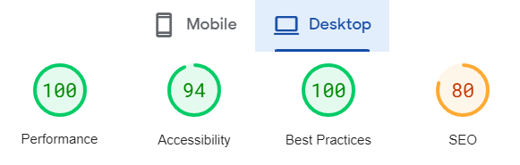

<body></body>
    <h1>Сборка лендинга для онлайн-магазина репродукций Ink. House</h1>
    <h3>Это учебный лендинг для освоения навыка верстки</h3>
    <h3>Данная сборка принадлежит автору канала <a href="https://www.youtube.com/@FreelancerLifeStyle" target="_blank">Фрілансер по життю</a> и изменена под условия моего макета</h3>
    <h3><a href="https://www.youtube.com/watch?v=jU88mLuLWlk&ab_channel=%D0%A4%D1%80%D1%96%D0%BB%D0%B0%D0%BD%D1%81%D0%B5%D1%80%D0%BF%D0%BE%D0%B6%D0%B8%D1%82%D1%82%D1%8E"  target="_blank">Ссылка на урок</a></h3>
    <h3>Используемый стек технологий:</h3>
    <ul>
        <li>
            
Шаблонизатор Pug

        </li>
        <li>
            
Препроцессор Sass в синтаксисе Scss

        </li>
        <li>
            
Язык программирования JavaScript

        </li>
        <li>
            
Таск-ранер Gulp

        </li>
    </ul>
    <h3>Показатели PageSpeed (хостинг GitHub Pages):</h3>
    
    
</body>